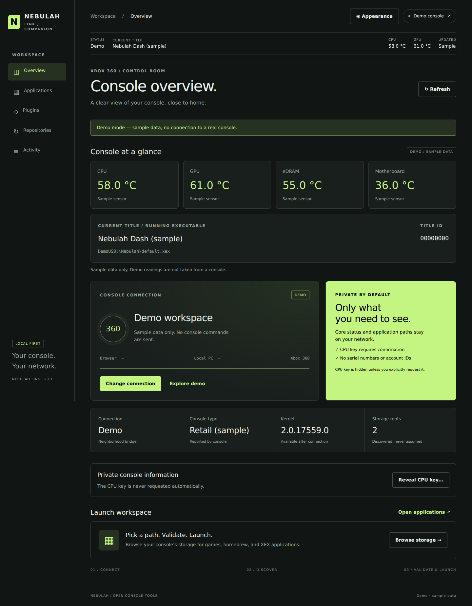

# Nebulah Link — Xbox 360 web companion

Development foundation for [Nebulah Web App](https://github.com/Nebulah360/Nebulah-Web-App). A locally hosted, responsive browser UI with a Windows Neighborhood bridge. PC and phone browsers use the same API; the console connection stays on the Windows host.

**Status: v0.1 development foundation, not a console-verified stable release.** Python validation and API tests run without hardware. The Windows XDevkit COM adapter must be smoke-tested against the user's installed Neighborhood version before relying on live launch operations. No proprietary SDK files are bundled.

## Preview



*Dashboard preview with sample console data.*

## Start on Windows

1. Install Python 3.10 or newer and your existing Xbox 360 Neighborhood installation. Confirm Neighborhood can browse the console first.
2. Download this repository with **Code → Download ZIP** and extract it, or clone it.
3. Double-click `start-local.cmd`.
4. Open `http://127.0.0.1:8765` in your browser.
5. Click **Connect console**, paste the pairing token printed in the terminal, and optionally enter the console's local IP or Neighborhood name. Blank uses Neighborhood's default.
6. Open **Applications**, select a discovered root, browse to an XEX, inspect it, then confirm launch.

The bridge defaults to 32-bit Windows PowerShell for XDevkit COM. If your COM registration uses another architecture, pass the appropriate executable:

```powershell
py -3 bridge/server.py --powershell C:\Windows\System32\WindowsPowerShell\v1.0\powershell.exe
```

## Game folder shortcuts

Open **Games** in the sidebar, select a discovered storage root, and browse to a game folder. Enter a shortcut name and save. To enable **Validate & launch**, choose **Use launch file** beside an XEX before saving. A folder-only shortcut opens that folder for browsing.

Shortcuts persist in `.local/games.sqlite3` on the Windows bridge and are shared by paired browsers and phones. They are grouped by the entered Neighborhood console name/IP (case-insensitive). A blank connection target uses a shared default profile; use explicit console names when managing multiple consoles or changing Neighborhood's default. Demo shortcuts are separate and last only for the page session.

Saving confirms the folder is accessible and any selected XEX exists. Every launch still inspects the current file, applies registry checks, requires confirmation, and rechecks the file before execution. Removing a shortcut only removes its saved entry. Shortcut support has automated coverage but still needs a real-console smoke test.

### Game preview and file checks

Choose **Game preview** on a shortcut for an artwork/detail panel and individual XEX launch files. The selected launch file is read automatically; use **Read metadata & verify** for other files such as `default_mp.xex`. Title ID, Media ID, file version and disc metadata come from the XEX. Game names and optional cover art come from the local game catalog; missing artwork gets a placeholder. This is a game-details preview, not a live console video stream.

- **Green check:** exact match to a reviewed unmodified game baseline.
- **Red check:** mismatch against matching reviewed baselines or a revoked file; launch is blocked.
- **Gray question mark:** not checked, unavailable, or no reviewed baseline for this file/edition/version.

Checks are per-file snapshots with timestamps; launching reads the file again. The game catalog starts empty, so real files will initially show unknown. See [game baseline review instructions](registry/README.md#game-baselines-and-artwork) to propose measured references and optional artwork. A modified file is not automatically malicious, and a green check is not a general safety guarantee.

### Propose a game baseline from the console

1. Open **Game preview** and use **Read metadata & verify** on the XEX you want to propose (the shortcut's selected launch file is inspected automatically).
2. Under **Propose a baseline**, check the selected filename, size and SHA-256. Enter the **Game title** and **Provenance**, describing its source, edition and any known modifications. These are your claims, not inferred review evidence.
3. Choose **Generate candidate JSON**, then **Copy JSON** or **Download JSON**. If clipboard access is unavailable, copy the selected JSON manually or download it.

The export contains one game-baseline entry with the inspected filename, Title ID, Media ID, raw version/base version, SHA-256 and size. It always has `state: "candidate"` and `unmodified: false`, with no review evidence or trust grant. Here `false` means unmodified provenance has not been attested; it is not a finding that the file was modified. The existing check color and `registry/games.json` remain unchanged. Submit the entry through the [separate baseline review process](registry/README.md#game-baselines-and-artwork); only a separately reviewed exact match can turn green.

Proposals use a bridge-held snapshot of the actual inspected bytes, valid for 10 minutes and cleared on reconnect. Up to 32 recent snapshots are kept in memory; older ones may expire earlier. Reinspect if the file changes or the snapshot expires. Unknown catalog files can be proposed when their execution metadata is complete; malformed XEX files, missing metadata and plugin modules cannot. Demo data cannot be exported as a console baseline. Exporting reads no private console fields, issues no launch ticket and performs no console/catalog write. Browser/API tests use synthetic files; Windows/console smoke testing remains pending.

**Trainers, title updates and GSC injection:** their preview sections are present but execution is unavailable. The current Neighborhood adapter has no tested implementations for these operations; GSC applicability and the active title update are not inferred from a filename. Automatic Aurora metadata/artwork import is also pending.

## Open on your phone

Find the PC's private IPv4 address with `ipconfig`, then bind the bridge to that exact address. Example only — replace the address with your PC's address:

```powershell
py -3 bridge/server.py --host 192.168.1.50
```

Open the printed URL on the phone on the same private Wi-Fi and enter the printed pairing token. Allow the selected TCP port (default 8765) through Windows Firewall on the **Private** network profile if prompted. Keep the PC and terminal running. No PC/console IP is hard-coded.

LAN mode uses HTTP: pairing and traffic are not encrypted. Use only trusted private networks; do not expose or port-forward the bridge. HTTPS/reverse-proxy support is future work. The initial base binds one explicit interface and does not enable wildcard CORS.

## Included

- Responsive overview, console connection, storage browser, XEX inspection and confirmed application launch.
- Games and homebrew use their console-provided paths; storage roots are discovered via Neighborhood.
- Explicit demo mode with sample data; demo launch never sends a console command.
- Core status allowlist: console type, kernel, storage roots, supported temperatures, running executable and title ID. Unknown properties display unavailable.
- In-memory session activity; no persistent telemetry, console secrets, serials, account IDs, DVD keys, or keyvault endpoints. CPU-key access is a separate confirmed operation.
- Pairing token, same-origin requests, Host validation, request bounds, fixed adapter operations, and path validation.
- XEX2 structural checks, SHA-256 file identity, short-lived single-use launch tickets, re-read before launch, and DLL/plugin launch rejection.

Structural validation is **not signature verification**, publisher trust, full loader validation, or a compatibility guarantee. Files over 64 MiB are intentionally rejected by this initial inspector. A small external-write race remains between re-read and console launch; avoid simultaneous console file transfers during launch.

## Appearance and live overview

Use **Appearance** in the header to change the accent with the color wheel, brightness slider, RGB channels (0–255), or 3/6-digit HEX. The controls stay synchronized, preview immediately, and remember the chosen color in this browser. Reset restores Nebulah green. Button/card text automatically uses black or white for contrast; dark accents use a lighter related color for text on dark panels. Keyboard users can adjust hue with left/right, saturation with up/down, and brightness with its slider.

The overview includes CPU, GPU, eDRAM and motherboard temperatures, running executable, title ID, connection, console type, kernel and discovered root count. A sticky status bar keeps current title, CPU/GPU and update age visible across sections. Status is refreshed every 10 seconds while visible and idle; hidden tabs, open dialogs and active operations pause polling. Failed refreshes clear readings, and readings older than 30 seconds are labeled stale. Polling preserves the directory being browsed.

Temperature readings and title ID use **optional read-only JRPC v2 `consolefeatures`** commands through Neighborhood. A compatible console plugin must already be installed; this app does not install or load it. Unsupported sensors are unavailable, never zero or invented. The running executable uses Neighborhood's `RunningProcessInfo.ProgramName`; friendly game-name lookup is not implemented. Demo readings are explicitly labeled samples. The four accepted sensor values are finite numbers above 0 and no higher than 125 °C; outside-range responses display unavailable rather than a false reading.

The new COM telemetry path requires Windows/console verification; automated tests cover response projection and invalid readings, not hardware compatibility. Protocol reference: [JRPC client](https://github.com/XboxChef/JRPC/blob/master/JRPC_Client/JRPC.cs), fixed read operations 15 (temperatures) and 16 (title ID). Normal status polling issues no private-info commands.

## Plugin and RTE boundary

**Plugin runtime loading is not implemented in v0.1.** Plugins cannot be treated as ordinary title launches. The UI marks the loader unavailable. Future work needs a tested JRPC/XRPC or Nebulah service adapter with capability negotiation, compatibility checks and explicit load/unload operations. Screenshots, title-aware tooling and plugin-slot management are future work. No arbitrary command or memory-write endpoint is exposed.

## Architecture

```text
PC / phone browser → local Python HTTP API → Windows PowerShell → XDevkit COM → console
```

`dist/` contains dependency-free browser assets; `bridge/server.py` implements auth, routing, validation and adapter boundaries; `bridge/neighborhood.ps1` contains the Neighborhood COM integration. This separation allows a future native mobile client to reuse the local API. The mobile app will still need the PC bridge unless a separate console-side LAN service is implemented.

See [API.md](API.md), [ROADMAP.md](ROADMAP.md), and [AGENTS.md](AGENTS.md).

## Tests

```sh
python -m unittest discover -s tests -v
node --check dist/app.js
node --check dist/theme.js
node --test tests/theme.test.cjs
node --test tests/game_candidates.test.cjs
python tools/xex_registry.py lint
python tools/game_baselines.py lint
```

Node is only needed for JavaScript syntax checks and tests, not to run the app. Candidate UI tests use a dependency-free DOM harness; they do not establish real-browser or console compatibility. No npm install or third-party Python package is required.

[Source and host validation](.github/workflows/source-host-validation.yml) runs these checks on pull requests targeting `main` and pushes to `main`, with read-only repository permissions. Any test, syntax or catalog-lint error fails CI. A passing run does not establish real-browser, Windows Neighborhood, Xbox console, CPU-key, launch or hardware acceptance; stable promotion still requires separate evidence.

## Console smoke-test checklist

- Confirm XDevkit COM creation in the chosen PowerShell architecture.
- Connect with both default Neighborhood target and explicit target.
- Verify discovered roots and directory entry shapes against actual COM responses.
- Verify available type/kernel fields; unsupported fields must stay unavailable.
- Inspect a known working homebrew XEX; verify hash against a local copy.
- Launch that homebrew after saving the current title's progress.
- Check malformed XEX and DLL modules cannot launch.
- Test a phone on the same trusted network, stale tickets, disconnected console and changed files.
- From Game preview, export an unknown game XEX candidate, compare its fields/hash/size to the inspected file, and confirm copy/download work on PC and phone. Verify it remains gray/unknown and the catalog is unchanged; reconnect and confirm a fresh inspection is required.

Do not promote to the stable public release channel until this checklist passes. This repository is the user-designated development repository; do not mirror testing commits into Nebulah Dash's stable repository.

Protocol/architecture references: [XboxChef/XDCKIT](https://github.com/XboxChef/XDCKIT) and [Experiment5X/XBDM](https://github.com/Experiment5X/XBDM). These are reference implementations, not vendored dependencies. COM member compatibility remains a hardware validation item.

## Optional CPU-key display

On Overview, choose **Reveal CPU key…**, then **Confirm — read and display CPU key**. Opening the prompt does not read the key. Canceling sends no key-read command. The bridge requires a fresh 60-second single-use confirmation ticket and `confirmed: true` before invoking JRPC v2 type 10. Reconnecting invalidates pending confirmations. This requires compatible JRPC support and remains subject to hardware testing.

The key is shown only in the dedicated dialog. It is cleared after 60 seconds, on dialog close, tab hiding, navigation or connection changes. A late response after dismissal is discarded. It is never included in status polling, activity logs, localStorage, exports or automatic clipboard operations. Responses use `Cache-Control: no-store`; the bridge does not persist keys. This is transient handling, not a guarantee of secure erasure from process/browser memory. LAN HTTP remains unencrypted, which is stated in the confirmation prompt.

## Reviewed-build verification

XEX inspection now reports registry identity separately from structural validity. Select an expected project build to see discrepancies; revoked or mismatched builds cannot launch. The catalog starts empty, so no existing binary is falsely labeled reviewed. Maintainers can propose actual-file hashes with `tools/xex_registry.py propose`, record review/hardware evidence, and revoke entries. `tools/xex_registry.py verify FILE --build ID` checks staged downloads and exits nonzero unless the selected reviewed build matches exactly. Repository installation automation is not yet implemented. See [registry documentation](registry/README.md) for the workflow and limitations.

## Repository update checks and plugin inventory

Check all preset and user-saved repositories:

```powershell
py -3 tools/nebulah.py check-updates
py -3 tools/nebulah.py save-repo owner/project
py -3 tools/nebulah.py repos
py -3 tools/nebulah.py remove-repo owner/project
```

The presets are `Nebulah360/Nebulah-Web-App` and `Nebulah360/Nebulah-Dash`. The web **Repositories** page offers the same save/remove/check controls. It can pair with the local bridge without connecting a console. Results include owner, stars, last repository push, metadata modification time, default branch, full commit revision, commit date, latest stable release/tag/date, license, forks, issues, archived state and description. First check establishes a baseline; subsequent checks show default-branch revision changes and whether the repository push timestamp changed. This is not a comparison against an installed binary, and a changed SHA can be a rewrite/rollback, not necessarily a newer release.

Only public GitHub REST metadata is currently supported. Private/inaccessible repositories, API limits and network errors are reported as unavailable; previous successful results are explicitly historical. The CLI exits 2 if any repository check is unavailable. Latest release lookup can fail independently of the commit check. No downloads, installs, XEX execution, or registry trust changes occur. Repository owner/stars are informational, not proof of safety.

Local repository subscriptions, last-success snapshots and plugin registrations are stored in `.local/repositories.sqlite3` (excluded from Git). No console secrets or pairing tokens are stored there. The web UI checks one repo at a time; CLI uses up to four workers. API redirects are disabled; only fixed `api.github.com/repos/…` paths are requested. A saved plugin's repository is automatically tracked.

```powershell
py -3 tools/nebulah.py register-plugin "My plugin" --version "1.0" --repo owner/plugin
py -3 tools/nebulah.py plugins
py -3 tools/nebulah.py remove-plugin "My plugin"
# For live backend/console inventory, set NEBULAH_BRIDGE_TOKEN to the token
# printed by your bridge, then use its exact local URL:
py -3 tools/nebulah.py plugins --bridge http://127.0.0.1:8765
```

The web **Plugins** view separates:

- **Console:** module names observed through Neighborhood's `DebugTarget.Modules`. This can include titles/system modules, so plugin classification is explicitly unverified. It is not a complete DashLaunch-slot inventory. Unreachable/unsupported consoles show unavailable. Hardware validation is still required.
- **Backend:** bundled Python components actually imported by the running bridge. These are labeled components, not third-party plugins; upstream repository revision is not claimed as their installed revision.
- **User:** names, declared versions and repositories registered by the user. These are labeled **registered-not-loaded** because this app does not yet have a user-code plugin loader. No arbitrary plugin code is executed.

Use Check updates to fill in owner/stars/revision/date metadata for linked repositories. Console module-to-repository mapping is not guessed from filenames. Registrations can be removed without deleting files or unloading console modules.
